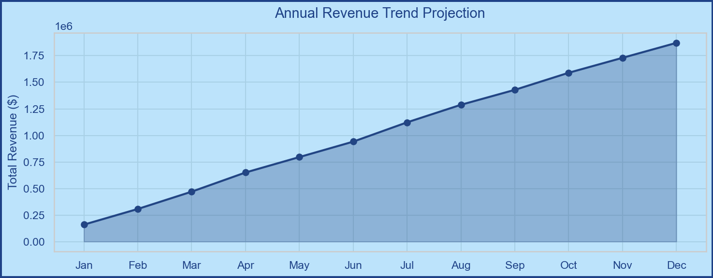
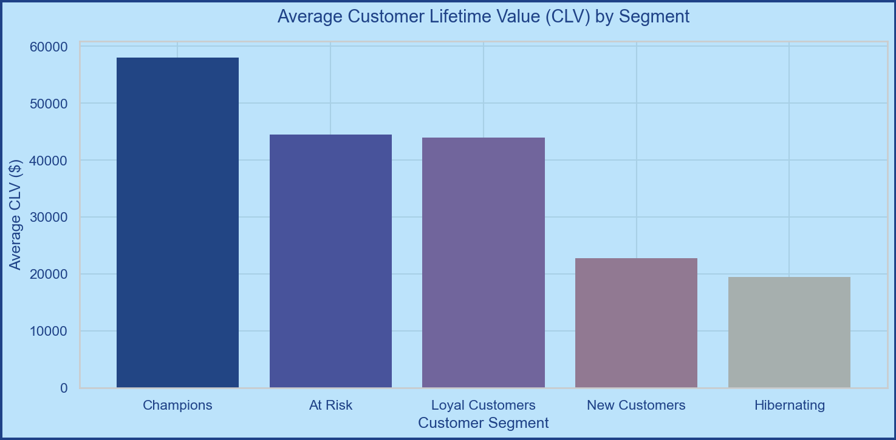

# 🛒 Retail Customer Segmentation & KPI Analytics

> **IS513E – Database for Direct Marketing & E-CRM**  
> A complete Python / Google Colab workflow for data-driven CRM decision-making.


---

## 👥 Group Members

| Name | Role |
|------|------|
| **Niranjan SAWANT** | Data cleaning, diagnosis & GDPR review |
| **Yasmine CHAKER** | EDA & data visualisation |
| **Mohamed HADJI** | RFM analysis, K-Means segmentation & KPIs |
| **Hiba RHARS** | Business interpretation, CRM recommendations |

**Course:** IS513E – Database for Direct Marketing & E-CRM  
**Date:** February 2026

---

## 📌 Project Overview

This project transforms a raw retail transactional dataset into actionable CRM intelligence through a structured, end-to-end Python analytics pipeline:

```
Raw CSV Transactions
        ↓
[Phase 1] Data Cleaning & Validation
        ↓
[Phase 2] Data Quality Diagnosis & GDPR Review
        ↓
[Phase 3] Exploratory Data Analysis (8 visualisations)
        ↓
[Phase 4] RFM Scoring + K-Means Customer Segmentation
        ↓
[Phase 5] CRM KPI Dashboard (CLV / AOV / Churn / Retention)
        ↓
[Phase 6] Segment-level CRM Recommendations (ACLM)
```

---

## 📂 Repository Structure

```
data2/
├── retail_crm_analytics.ipynb   ← Main deliverable (43 cells, all 6 phases)
├── README.md                    ← This file
└── build_nb.py                  ← Script used to generate the notebook
```

> **Dataset:** Download `retail_transactional_dataset.csv` from  
> [kaggle.com/datasets/bhavikjikadara/retail-transactional-dataset](https://www.kaggle.com/datasets/bhavikjikadara/retail-transactional-dataset)  
> and upload it to your Colab session before running.

---

## 🚀 Quick Start (Google Colab)

1. Click **Open in Colab** or go to [colab.research.google.com](https://colab.research.google.com)
2. **File → Upload notebook** → select `retail_crm_analytics.ipynb`
3. Upload the CSV file:
   - Drag it into the **file browser** (left sidebar 📁), **or**
   - Uncomment the `files.upload()` block in **Cell 1.1**
4. **Runtime → Run all** (`Ctrl+F9`)

> Cell 0 installs all dependencies automatically — no local setup needed.

---

## 📊 Analytics Phases

### Phase 1 · Data Import & Cleaning *(Niranjan)*
- Loads CSV and normalises column names to `lower_snake_case`
- Auto-detects column mapping via substring matching (robust to naming variations)
- Parses dates, coerces numeric types, removes nulls and duplicates
- Computes `total_amount = quantity × price_per_unit` when missing

### Phase 2 · Data Diagnosis & GDPR Review *(Niranjan)*
- Full data quality report: shape, nulls, date range, descriptive stats
- GDPR field risk assessment (Art. 89 Reg. EU 2016/679):

| Field | Classification | Risk Level |
|-------|---------------|------------|
| `customer_id` | Pseudonymous identifier | LOW |
| `age` | Quasi-identifier | MEDIUM |
| `gender` | Quasi-identifier | MEDIUM |
| `location` | Quasi-identifier | MEDIUM |
- Age binned into anonymised bands (`<25`, `25-34`, …, `65+`)

### Phase 3 · Exploratory Data Analysis *(Yasmine)*
8 visualisations covering:
- 📈 Monthly revenue trend (filled line chart)
- 🏷️ Revenue by product category (horizontal bar)
- 💳 Payment method distribution (pie + bar)
- 🏙️ Revenue by store location (top 15)
- 🏷️ Discount impact on Average Order Value
- 👑 Top 10 customers by total spend
- 📅 Average spend by day of week
- 👤 Spend by age band & gender (heatmap bar)



### Phase 4 · RFM Analysis & K-Means Clustering *(Mohamed)*
**RFM Scoring:**
- **Recency** — days since last purchase (lower = better, score 5→1)
- **Frequency** — number of distinct transactions (higher = better, score 1→5)
- **Monetary** — total spend (higher = better, score 1→5)
- Composite RFM score (3–15) + 3-character segment code

**K-Means Clustering:**
- StandardScaler normalisation on R/F/M features
- Optimal k via Elbow Method + Silhouette Score (k=2–9 tested)
- Interactive 3-D scatter plot (Plotly)
- Business labels assigned by Monetary rank: **Champions → Loyal Customers → At-Risk → Lost → New → Potential Loyalists**

### Phase 5 · KPI Development *(Mohamed)*

| KPI | Formula |
|-----|---------|
| **Customer Lifetime Value (CLV)** | Total revenue per customer over obs. period |
| **Average Order Value (AOV)** | `sum(total) / count(transactions)` |
| **Purchase Frequency** | `transactions / unique_customers` |
| **Avg Basket Size** | `mean(quantity)` per transaction |
| **Churn Proxy** | `% customers with Recency > 90 days` |
| **Retention Rate** | `% customers with Frequency ≥ 2` |

All KPIs computed **globally** and **per segment** with a 2×2 dashboard chart.



### Phase 6 · CRM Recommendations *(Hiba)*

| Segment | Strategy | Key Tactic |
|---------|----------|-----------|
| **Champions** | Reward & Retain | VIP loyalty tier + referral programme |
| **Loyal Customers** | Increase frequency & basket | Cross-sell + bundle discounts |
| **At-Risk** | Win-Back | "We miss you" email + urgency offer (7-day) |
| **Lost** | Reactivation / Suppress | Last-chance 20% off → GDPR suppression |
| **New Customers** | Onboarding | 3-email welcome series + sign-up bonus |
| **Potential Loyalists** | Nurture | Progress bar to VIP + flash sales |

Visual output: **CRM Priority Bubble Chart** — Churn Rate vs CLV, sized by customer count.

---

## 📦 Dependencies

```
pandas        numpy        matplotlib     seaborn
scikit-learn  plotly        kaleido
```
All installed automatically by the first notebook cell.

---

## 🔒 GDPR & Ethics

- Customer IDs are treated as **opaque tokens** — never decoded or linked to real persons.  
- Geographic (city) data is used **only for aggregate visualisation**.  
- Age is presented as **anonymised bands**, not raw values.  
- No join to external datasets that could enable re-identification.  
- Legal basis: **Art. 89 GDPR** — academic research on publicly available data.

---

## 📋 Key Takeaways

- **Champions & Loyal Customers** drive the bulk of revenue → prioritise retention investment.  
- **At-Risk & Lost** clusters signal revenue leakage → time-sensitive win-back campaigns critical.  
- **New Customers** need structured onboarding journeys to convert to loyalists.  
- Combining **quintile RFM scoring** with **K-Means** yields richer, more actionable segments than manual cuts alone.

---

*Generated for IS513E – Database for Direct Marketing & E-CRM*  
*Group: Chaker · Hadji · Rhars · Sawant | February 2026*
